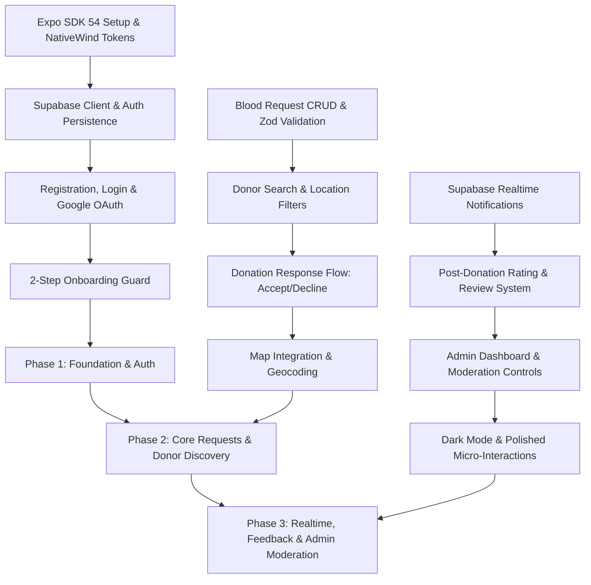

# RoktoSheba — Agent Development & Production Engineering Guide (`AGENT.md`)

> **Role & Persona:** Senior Full-Stack Mobile & Cloud Solutions Architect.  
> **Target Audience:** Autonomous AI Agents & Developers building **RoktoSheba** to production standards.  
> **Source Documents:** Must strictly adhere to [`PROJECT_PLAN.md`](./PROJECT_PLAN.md) and [`DESIGN.md`](./DESIGN.md).

---

## 1. System Architecture & Tech Stack Rules

### 1.1 Tech Stack Versions & Modern Standards

| Layer / Concern         | Tech / Library                                        | Standard & Version Rules                                                                                                                              |
| :---------------------- | :---------------------------------------------------- | :---------------------------------------------------------------------------------------------------------------------------------------------------- |
| **Runtime & Framework** | **Expo SDK 54 / React Native**                        | Strict TypeScript (`noImplicitAny: true`, `strict: true`). Use Expo Router (File-based navigation v4+).                                               |
| **Styling**             | **NativeWind (Tailwind CSS)**                         | NativeWind v4. Use design tokens defined in `DESIGN.md` (e.g., `#DC2626` primary, `Inter` typography).                                                |
| **Backend & Auth**      | **Supabase (PostgreSQL + Auth + Storage + Realtime)** | `@supabase/supabase-js` v2. Client instantiated with persistent async storage (`expo-secure-store` or `@react-native-async-storage/async-storage`).   |
| **Server Data State**   | **TanStack Query (React Query v5)**                   | Strict query key factory pattern (`queryKeys.requests.detail(id)`). Explicit mutations with automatic invalidation.                                   |
| **Client Local State**  | **Zustand v5**                                        | Lightweight atomic client stores (`useAuthStore`, filters, UI state). No heavy Context re-render cascades.                                            |
| **Forms & Validation**  | **React Hook Form + Zod**                             | Controlled forms with `@hookform/resolvers/zod`. Zero unchecked form inputs.                                                                          |
| **Device Capabilities** | **Expo Native Modules**                               | `expo-image-picker`, `expo-location`, `expo-font`, `react-native-maps`. Always check runtime permissions gracefully.                                  |
| **Visual Assets**       | **Image-First UI**                                    | Strictly follow `DESIGN.md`: use PNG/WebP assets from `assets/images/` for tab icons, badges, indicators, and avatars instead of SVG icon font packs. |

---

## 2. Codebase Structure & Directory Standards

Every feature must be encapsulated in a modular, feature-driven structure:

```text
RoktoSheba/
├── app/                              # Expo Router Routes (UI layer only)
│   ├── (auth)/                       # Unauthenticated group
│   │   ├── _layout.tsx
│   │   ├── login.tsx
│   │   ├── register.tsx
│   │   ├── forgot-password.tsx
│   │   └── verify-email.tsx
│   ├── (onboarding)/                 # Profile completion guard group
│   │   ├── _layout.tsx
│   │   └── step-[step].tsx
│   ├── (main)/                       # Authenticated Tabs layout
│   │   ├── _layout.tsx               # 5-Tab Bar + Center Floating FAB
│   │   ├── index.tsx                 # (Home Tab)
│   │   ├── requests/
│   │   │   ├── index.tsx             # List / Discovery
│   │   │   ├── [id].tsx              # Request Details
│   │   │   └── create.tsx            # Create Request
│   │   ├── donors/
│   │   │   ├── index.tsx             # Donor Search
│   │   │   └── [id].tsx              # Donor Public Profile
│   │   ├── notifications.tsx
│   │   ├── profile/
│   │   │   ├── index.tsx             # User Profile
│   │   │   └── edit.tsx              # Edit Profile
│   │   └── learn.tsx                 # Educational & Awareness video
│   ├── admin/                        # Admin-only routes
│   │   ├── _layout.tsx
│   │   ├── dashboard.tsx
│   │   ├── users.tsx
│   │   ├── requests.tsx
│   │   └── reports.tsx
│   ├── _layout.tsx                   # Root Provider stack (QueryClient, AuthProvider, Theme)
│   └── +not-found.tsx
├── assets/                           # Image-first static assets per DESIGN.md
│   ├── images/
│   │   ├── logo/
│   │   ├── tabs/
│   │   ├── blood-groups/
│   │   ├── urgency/
│   │   ├── empty-states/
│   │   └── misc/
│   └── fonts/                        # Inter font files
├── components/                       # Shared reusable UI primitives
│   ├── ui/
│   │   ├── AppButton.tsx
│   │   ├── AppInput.tsx
│   │   ├── BloodGroupBadge.tsx
│   │   ├── UrgencyTag.tsx
│   │   ├── FilterChip.tsx
│   │   ├── StarRating.tsx
│   │   ├── Avatar.tsx
│   │   ├── BottomSheet.tsx
│   │   └── EmptyState.tsx
│   └── feedback/
│       ├── LoadingSkeleton.tsx
│       ├── ErrorToast.tsx
│       └── ConfirmDialog.tsx
├── features/                         # Business logic, hooks, state, and domain components
│   ├── auth/
│   │   ├── hooks/useAuth.ts
│   │   ├── services/authService.ts
│   │   └── schemas/authSchema.ts
│   ├── profile/
│   │   ├── hooks/useProfile.ts
│   │   ├── services/profileService.ts
│   │   └── components/
│   ├── requests/
│   │   ├── hooks/useRequests.ts
│   │   ├── hooks/useResponses.ts
│   │   ├── services/requestService.ts
│   │   └── components/RequestCard.tsx
│   ├── donors/
│   │   ├── hooks/useDonors.ts
│   │   └── services/donorService.ts
│   ├── notifications/
│   │   ├── hooks/useRealtimeNotifications.ts
│   │   └── services/notificationService.ts
│   └── admin/
│       ├── hooks/useAdminStats.ts
│       └── services/adminService.ts
├── lib/
│   ├── supabase/
│   │   ├── client.ts                 # Supabase client singleton with SecureStore
│   │   └── types.ts                  # Generated database schema types
│   ├── queryClient.ts                # TanStack query configuration
│   └── utils/
│       ├── bangladeshLocations.ts    # Divisions, districts & upazilas dataset
│       ├── dateUtils.ts              # Relative dates, formatting
│       └── errorHandler.ts           # Unified API error handler
├── types/                            # Global & domain TypeScript definitions
│   ├── index.ts
│   ├── database.types.ts
│   └── navigation.types.ts
└── tailwind.config.js                # NativeWind color tokens, fonts & spacing
```

---

## 3. Production Coding Standards for Agents

### 3.1 Strict Typing & Schema Generation

1. **Never use `any`**. Use explicit interfaces, Zod inferred types, or Supabase generated types (`Database['public']['Tables']['...']`).
2. Centralize validation schemas in `features/<feature>/schemas/<feature>Schema.ts`.
3. Use Zod transforms for formatting inputs (e.g. trimming whitespace, sanitizing Bangladesh phone numbers `+8801XXXXXXXXX`).

### 3.2 Secure Supabase Client Pattern (React Native)

Supabase Auth requires a custom storage adapter for session persistence in Expo:

```typescript
// lib/supabase/client.ts
import "react-native-url-polyfill/auto";
import { createClient } from "@supabase/supabase-js";
import AsyncStorage from "@react-native-async-storage/async-storage";
import { Database } from "@/types/database.types";

const supabaseUrl = process.env.EXPO_PUBLIC_SUPABASE_URL!;
const supabaseAnonKey = process.env.EXPO_PUBLIC_SUPABASE_ANON_KEY!;

if (!supabaseUrl || !supabaseAnonKey) {
  throw new Error("Missing Supabase Environment Variables");
}

export const supabase = createClient<Database>(supabaseUrl, supabaseAnonKey, {
  auth: {
    storage: AsyncStorage,
    autoRefreshToken: true,
    persistSession: true,
    detectSessionInUrl: false,
  },
});
```

### 3.3 TanStack Query v5 Best Practices

1. **Query Key Factories:**
   ```typescript
   export const requestKeys = {
     all: ["requests"] as const,
     lists: () => [...requestKeys.all, "list"] as const,
     list: (filters: RequestFilters) =>
       [...requestKeys.lists(), filters] as const,
     details: () => [...requestKeys.all, "detail"] as const,
     detail: (id: string) => [...requestKeys.details(), id] as const,
   };
   ```
2. **Mutations with Invalidation:**
   Always invalidate target query keys on `onSuccess`. Avoid manual local state synchronizations when TanStack Query can fetch fresh server state.
3. **Error Boundaries & Toasts:**
   Centralize error logging. Display human-readable error messages via context toasts or snackbars.

### 3.4 Image-First UI Implementation

1. Use pre-rendered PNG assets specified in `DESIGN.md`.
2. Wrap assets in strong TypeScript mapping tables:

   ```typescript
   // components/ui/BloodGroupBadge.tsx
   import { Image, ImageSourcePropType } from "react-native";

   const BLOOD_BADGES: Record<string, ImageSourcePropType> = {
     "A+": require("@/assets/images/blood-groups/badge-a-pos.png"),
     "A-": require("@/assets/images/blood-groups/badge-a-neg.png"),
     "B+": require("@/assets/images/blood-groups/badge-b-pos.png"),
     "B-": require("@/assets/images/blood-groups/badge-b-neg.png"),
     "O+": require("@/assets/images/blood-groups/badge-o-pos.png"),
     "O-": require("@/assets/images/blood-groups/badge-o-neg.png"),
     "AB+": require("@/assets/images/blood-groups/badge-ab-pos.png"),
     "AB-": require("@/assets/images/blood-groups/badge-ab-neg.png"),
   };
   ```

---

## 4. Supabase Backend Architecture & Manual Setup Guide

The agent or engineer must configure the Supabase cloud instance properly. Follow these exact steps:

### 4.1 SQL Database Schema & Triggers

Execute the following complete schema in the **Supabase SQL Editor**:

```sql
-- Enable UUID extension
create extension if not exists "uuid-ossp";

-- 1. Create Enums
create type user_role as enum ('user', 'admin');
create type blood_group_type as enum ('A+', 'A-', 'B+', 'B-', 'O+', 'O-', 'AB+', 'AB-');
create type urgency_level as enum ('normal', 'urgent', 'critical');
create type request_status as enum ('active', 'fulfilled', 'cancelled', 'expired');
create type response_status as enum ('pending', 'accepted', 'declined', 'cancelled');
create type report_status as enum ('pending', 'reviewed', 'dismissed');

-- 2. Profiles Table (1-to-1 with auth.users)
create table public.profiles (
  id uuid references auth.users on delete cascade primary key,
  role user_role not null default 'user',
  full_name text,
  phone text,
  blood_group blood_group_type,
  date_of_birth date,
  division text,
  district text,
  area text,
  address_detail text,
  avatar_url text,
  is_available_to_donate boolean not null default false,
  last_donation_date date,
  onboarding_completed boolean not null default false,
  is_active boolean not null default true,
  created_at timestamp with time zone default now() not null,
  updated_at timestamp with time zone default now() not null
);

-- 3. Automatic Profile Creation Trigger on Auth Sign-Up
create or replace function public.handle_new_user()
returns trigger as $$
begin
  insert into public.profiles (id, full_name, avatar_url)
  values (
    new.id,
    new.raw_user_meta_data->>'full_name',
    new.raw_user_meta_data->>'avatar_url'
  );
  return new;
end;
$$ language plpgsql security definer;

create trigger on_auth_user_created
  after insert on auth.users
  for each row execute function public.handle_new_user();

-- 4. Blood Requests Table
create table public.blood_requests (
  id uuid default uuid_generate_v4() primary key,
  created_by uuid references public.profiles(id) on delete cascade not null,
  patient_name text not null,
  blood_group blood_group_type not null,
  hospital_name text not null,
  division text not null,
  district text not null,
  area text not null,
  needed_date_time timestamp with time zone not null,
  urgency urgency_level not null default 'normal',
  contact_number text not null,
  document_image_url text,
  latitude double precision,
  longitude double precision,
  status request_status not null default 'active',
  created_at timestamp with time zone default now() not null,
  updated_at timestamp with time zone default now() not null
);

-- 5. Donation Responses Table
create table public.donation_responses (
  id uuid default uuid_generate_v4() primary key,
  request_id uuid references public.blood_requests(id) on delete cascade not null,
  donor_id uuid references public.profiles(id) on delete cascade not null,
  message text,
  status response_status not null default 'pending',
  created_at timestamp with time zone default now() not null,
  updated_at timestamp with time zone default now() not null,
  constraint unique_donor_per_request unique (request_id, donor_id)
);

-- 6. Donation Feedback / Rating Table
create table public.donation_feedback (
  id uuid default uuid_generate_v4() primary key,
  response_id uuid references public.donation_responses(id) on delete cascade not null,
  author_id uuid references public.profiles(id) on delete cascade not null,
  recipient_id uuid references public.profiles(id) on delete cascade not null,
  rating smallint check (rating >= 1 and rating <= 5) not null,
  comment text,
  created_at timestamp with time zone default now() not null
);

-- 7. Notifications Table
create table public.notifications (
  id uuid default uuid_generate_v4() primary key,
  user_id uuid references public.profiles(id) on delete cascade not null,
  title text not null,
  body text not null,
  type text not null,
  entity_id uuid,
  is_read boolean not null default false,
  created_at timestamp with time zone default now() not null
);

-- 8. Moderation Reports Table
create table public.reports (
  id uuid default uuid_generate_v4() primary key,
  reporter_id uuid references public.profiles(id) on delete cascade not null,
  target_type text not null check (target_type in ('user', 'request')),
  target_id uuid not null,
  reason text not null,
  status report_status not null default 'pending',
  reviewed_by uuid references public.profiles(id),
  created_at timestamp with time zone default now() not null,
  updated_at timestamp with time zone default now() not null
);
```

---

### 4.2 Row Level Security (RLS) Policies

All tables must enforce strict RLS policies to prevent unauthorized data access:

```sql
-- Enable RLS on all tables
alter table public.profiles enable row level security;
alter table public.blood_requests enable row level security;
alter table public.donation_responses enable row level security;
alter table public.donation_feedback enable row level security;
alter table public.notifications enable row level security;
alter table public.reports enable row level security;

-- Helper Admin Check function
create or replace function public.is_admin()
returns boolean as $$
  select exists (
    select 1 from public.profiles
    where id = auth.uid() and role = 'admin'
  );
$$ language sql security definer;

-- PROFILES POLICIES
create policy "Public profiles are readable by authenticated users"
  on public.profiles for select
  to authenticated
  using (is_active = true or is_admin());

create policy "Users can update their own profile"
  on public.profiles for update
  to authenticated
  using (id = auth.uid())
  with check (
    id = auth.uid()
    and role = (select role from public.profiles where id = auth.uid()) -- Prevent self role-elevation
  );

create policy "Admins have full control over profiles"
  on public.profiles for all
  to authenticated
  using (is_admin());

-- BLOOD REQUESTS POLICIES
create policy "Active requests readable by all authenticated"
  on public.blood_requests for select
  to authenticated
  using (true);

create policy "Users can insert their own requests"
  on public.blood_requests for insert
  to authenticated
  with check (created_by = auth.uid());

create policy "Users can update their own requests"
  on public.blood_requests for update
  to authenticated
  using (created_by = auth.uid() or is_admin());

-- DONATION RESPONSES POLICIES
create policy "Responders and request owners can view responses"
  on public.donation_responses for select
  to authenticated
  using (
    donor_id = auth.uid()
    or exists (
      select 1 from public.blood_requests
      where id = donation_responses.request_id and created_by = auth.uid()
    )
    or is_admin()
  );

create policy "Available donors can submit responses"
  on public.donation_responses for insert
  to authenticated
  with check (donor_id = auth.uid());

create policy "Participants can update response status"
  on public.donation_responses for update
  to authenticated
  using (
    donor_id = auth.uid()
    or exists (
      select 1 from public.blood_requests
      where id = donation_responses.request_id and created_by = auth.uid()
    )
    or is_admin()
  );

-- NOTIFICATIONS POLICIES
create policy "Users can view their own notifications"
  on public.notifications for select
  to authenticated
  using (user_id = auth.uid());

create policy "Users can mark own notifications read"
  on public.notifications for update
  to authenticated
  using (user_id = auth.uid());

-- REPORTS POLICIES
create policy "Users can create reports"
  on public.reports for insert
  to authenticated
  with check (reporter_id = auth.uid());

create policy "Only admins can view and update reports"
  on public.reports for all
  to authenticated
  using (is_admin());
```

---

### 4.3 Supabase Storage Buckets Setup

In Supabase Dashboard → **Storage**, create two public buckets:

1. **`avatars`** (Public)
   - Max file size: `5MB`
   - Allowed MIME types: `image/jpeg`, `image/png`, `image/webp`
   - Storage RLS Policy:
     - **Select**: Anyone can view (`bucket_id = 'avatars'`)
     - **Insert/Update**: Authenticated user with matching folder/file name:
       ```sql
       create policy "Users can upload their own avatar"
         on storage.objects for insert
         to authenticated
         with check (bucket_id = 'avatars' and (storage.foldername(name))[1] = auth.uid()::text);
       ```
2. **`request-documents`** (Public)
   - Max file size: `10MB`
   - Allowed MIME types: `image/jpeg`, `image/png`, `image/webp`
   - Storage RLS Policy:
     - **Select**: Authenticated users
     - **Insert**: Authenticated users (`bucket_id = 'request-documents'`)

---

### 4.4 Supabase Realtime Publication

In the Supabase SQL editor, enable Realtime for in-app alerts and live response coordination:

```sql
begin;
  -- remove the supabase_realtime publication if exists
  drop publication if exists supabase_realtime;
  -- re-create publication for targeted tables
  create publication supabase_realtime for table
    public.notifications,
    public.donation_responses,
    public.blood_requests;
commit;
```

---

### 4.5 Email OTP Verification & External Auth Config

1. **Email OTP Setup (Supabase Dashboard):**
   - Go to **Authentication** → **Email Templates**.
   - Under **Confirm signup**, update template to the responsive HTML layout:
     ```html
     <!DOCTYPE html>
     <html lang="en">
       <head>
         <meta charset="UTF-8" />
         <meta
           name="viewport"
           content="width=device-width, initial-scale=1.0"
         />
         <title>Verify Your Email — RoktoSheba</title>
       </head>
       <body
         style="margin: 0; padding: 0; background-color: #F3F4F6; font-family: -apple-system, BlinkMacSystemFont, 'Segoe UI', Roboto, Helvetica, Arial, sans-serif; -webkit-font-smoothing: antialiased;"
       >
         <table
           role="presentation"
           border="0"
           cellpadding="0"
           cellspacing="0"
           width="100%"
           style="background-color: #F3F4F6; padding: 24px 12px;"
         >
           <tr>
             <td align="center">
               <table
                 role="presentation"
                 border="0"
                 cellpadding="0"
                 cellspacing="0"
                 width="100%"
                 style="max-width: 520px; background-color: #FFFFFF; border-radius: 16px; overflow: hidden; box-shadow: 0 4px 12px rgba(0, 0, 0, 0.05); border: 1px solid #E5E7EB;"
               >
                 <tr>
                   <td
                     align="center"
                     style="background-color: #DC2626; padding: 32px 24px; text-align: center;"
                   >
                     <table
                       role="presentation"
                       border="0"
                       cellpadding="0"
                       cellspacing="0"
                     >
                       <tr>
                         <td
                           align="center"
                           style="background-color: #FFFFFF; width: 48px; height: 48px; border-radius: 50%; text-align: center;"
                         >
                           <span style="font-size: 26px; line-height: 48px;"
                             >🩸</span
                           >
                         </td>
                       </tr>
                     </table>
                     <h1
                       style="color: #FFFFFF; font-size: 24px; font-weight: 700; margin: 12px 0 4px 0; letter-spacing: -0.5px;"
                     >
                       RoktoSheba
                     </h1>
                     <p
                       style="color: #FEE2E2; font-size: 13px; font-weight: 500; margin: 0; text-transform: uppercase; letter-spacing: 1px;"
                     >
                       Every Drop Saves a Life
                     </p>
                   </td>
                 </tr>
                 <tr>
                   <td style="padding: 32px 24px; text-align: center;">
                     <h2
                       style="color: #111827; font-size: 20px; font-weight: 700; margin: 0 0 12px 0;"
                     >
                       Verify Your Email Address
                     </h2>
                     <p
                       style="color: #4B5563; font-size: 15px; line-height: 1.5; margin: 0 0 24px 0;"
                     >
                       Thank you for joining <strong>RoktoSheba</strong>. Please
                       use the 8-digit verification code below to confirm your
                       account and complete registration.
                     </p>
                     <table
                       role="presentation"
                       border="0"
                       cellpadding="0"
                       cellspacing="0"
                       width="100%"
                       style="margin: 0 0 24px 0;"
                     >
                       <tr>
                         <td align="center">
                           <div
                             style="background-color: #FEF2F2; border: 2px dashed #FCA5A5; border-radius: 12px; padding: 16px 24px; display: inline-block;"
                           >
                             <span
                               style="font-family: 'Courier New', Courier, monospace; color: #DC2626; font-size: 32px; font-weight: 800; letter-spacing: 6px; display: block;"
                               >{{ .Token }}</span
                             >
                           </div>
                         </td>
                       </tr>
                     </table>
                     <p
                       style="color: #6B7280; font-size: 13px; line-height: 1.5; margin: 0 0 24px 0;"
                     >
                       Enter this code inside the RoktoSheba app. This code is
                       valid for 15 minutes.
                     </p>
                     <div
                       style="border-top: 1px solid #E5E7EB; padding-top: 20px; text-align: left;"
                     >
                       <p
                         style="color: #9CA3AF; font-size: 12px; line-height: 1.4; margin: 0;"
                       >
                         🔒 <strong>Security Note:</strong> If you did not sign
                         up for a RoktoSheba account, please ignore this email.
                         Never share this verification code with anyone.
                       </p>
                     </div>
                   </td>
                 </tr>
                 <tr>
                   <td
                     align="center"
                     style="background-color: #F9FAFB; padding: 20px 24px; border-top: 1px solid #E5E7EB; text-align: center;"
                   >
                     <p style="color: #9CA3AF; font-size: 12px; margin: 0;">
                       &copy; RoktoSheba Blood Donation Network &bull;
                       Bangladesh
                     </p>
                   </td>
                 </tr>
               </table>
             </td>
           </tr>
         </table>
       </body>
     </html>
     ```
   - Under **Reset password**, update template to the responsive HTML layout:
     ```html
     <!DOCTYPE html>
     <html lang="en">
       <head>
         <meta charset="UTF-8" />
         <meta
           name="viewport"
           content="width=device-width, initial-scale=1.0"
         />
         <title>Reset Your Password — RoktoSheba</title>
       </head>
       <body
         style="margin: 0; padding: 0; background-color: #F3F4F6; font-family: -apple-system, BlinkMacSystemFont, 'Segoe UI', Roboto, Helvetica, Arial, sans-serif; -webkit-font-smoothing: antialiased;"
       >
         <table
           role="presentation"
           border="0"
           cellpadding="0"
           cellspacing="0"
           width="100%"
           style="background-color: #F3F4F6; padding: 24px 12px;"
         >
           <tr>
             <td align="center">
               <table
                 role="presentation"
                 border="0"
                 cellpadding="0"
                 cellspacing="0"
                 width="100%"
                 style="max-width: 520px; background-color: #FFFFFF; border-radius: 16px; overflow: hidden; box-shadow: 0 4px 12px rgba(0, 0, 0, 0.05); border: 1px solid #E5E7EB;"
               >
                 <tr>
                   <td
                     align="center"
                     style="background-color: #DC2626; padding: 32px 24px; text-align: center;"
                   >
                     <table
                       role="presentation"
                       border="0"
                       cellpadding="0"
                       cellspacing="0"
                     >
                       <tr>
                         <td
                           align="center"
                           style="background-color: #FFFFFF; width: 48px; height: 48px; border-radius: 50%; text-align: center;"
                         >
                           <span style="font-size: 26px; line-height: 48px;"
                             >🔑</span
                           >
                         </td>
                       </tr>
                     </table>
                     <h1
                       style="color: #FFFFFF; font-size: 24px; font-weight: 700; margin: 12px 0 4px 0; letter-spacing: -0.5px;"
                     >
                       Password Reset
                     </h1>
                     <p
                       style="color: #FEE2E2; font-size: 13px; font-weight: 500; margin: 0; text-transform: uppercase; letter-spacing: 1px;"
                     >
                       RoktoSheba Account Security
                     </p>
                   </td>
                 </tr>
                 <tr>
                   <td style="padding: 32px 24px; text-align: center;">
                     <h2
                       style="color: #111827; font-size: 20px; font-weight: 700; margin: 0 0 12px 0;"
                     >
                       Password Recovery Code
                     </h2>
                     <p
                       style="color: #4B5563; font-size: 15px; line-height: 1.5; margin: 0 0 24px 0;"
                     >
                       We received a request to reset your
                       <strong>RoktoSheba</strong> account password. Use the
                       8-digit recovery code below to choose a new password:
                     </p>
                     <table
                       role="presentation"
                       border="0"
                       cellpadding="0"
                       cellspacing="0"
                       width="100%"
                       style="margin: 0 0 24px 0;"
                     >
                       <tr>
                         <td align="center">
                           <div
                             style="background-color: #FEF2F2; border: 2px dashed #FCA5A5; border-radius: 12px; padding: 16px 24px; display: inline-block;"
                           >
                             <span
                               style="font-family: 'Courier New', Courier, monospace; color: #DC2626; font-size: 32px; font-weight: 800; letter-spacing: 6px; display: block;"
                               >{{ .Token }}</span
                             >
                           </div>
                         </td>
                       </tr>
                     </table>
                     <p
                       style="color: #6B7280; font-size: 13px; line-height: 1.5; margin: 0 0 24px 0;"
                     >
                       Enter this recovery code in the RoktoSheba app reset
                       screen. This code expires in 15 minutes.
                     </p>
                     <div
                       style="border-top: 1px solid #E5E7EB; padding-top: 20px; text-align: left;"
                     >
                       <p
                         style="color: #9CA3AF; font-size: 12px; line-height: 1.4; margin: 0;"
                       >
                         🛡️ <strong>Security Warning:</strong> If you did not
                         request a password reset, your account is still secure.
                         You can safely ignore this email.
                       </p>
                     </div>
                   </td>
                 </tr>
                 <tr>
                   <td
                     align="center"
                     style="background-color: #F9FAFB; padding: 20px 24px; border-top: 1px solid #E5E7EB; text-align: center;"
                   >
                     <p style="color: #9CA3AF; font-size: 12px; margin: 0;">
                       &copy; RoktoSheba Blood Donation Network &bull;
                       Bangladesh
                     </p>
                   </td>
                 </tr>
               </table>
             </td>
           </tr>
         </table>
       </body>
     </html>
     ```
   - **Unconfirmed Login Handling**: If an unconfirmed user attempts to sign in (`error: Email not confirmed`), automatically dispatch a fresh 8-digit OTP via `supabase.auth.resend({ type: 'signup', email })` and route to `app/(auth)/verify-email.tsx`.
2. **Authentication Policy**:
   - RoktoSheba strictly uses **Email & Password + 8-Digit Email OTP** verification.
   - Third-party OAuth (Google, Apple, etc.) is completely excluded from the application architecture to ensure a self-contained, lightweight auth system without external domain verifications.
3. **Expo `app.json` Scheme:**
   ```json
   {
     "expo": {
       "scheme": "roktosheba"
     }
   }
   ```

---

## 5. Environment Variables & Security

Create a `.env` file in the project root:

```ini
# Supabase Public Keys (Safe for client build)
EXPO_PUBLIC_SUPABASE_URL=https://your-project-id.supabase.co
EXPO_PUBLIC_SUPABASE_ANON_KEY=eyJhbGciOi...

# Google Maps / Geocoding (if applicable)
EXPO_PUBLIC_GOOGLE_MAPS_API_KEY=AIzaSy...
```

> [!CAUTION]
> **Never commit `SUPABASE_SERVICE_ROLE_KEY`** or any administrative secret into client application code or Git repositories.

---

## 6. Implementation Phasing & Quality Assurance Checklist

When building out the project, follow this exact sequence:



### Pre-Flight Verification Checklist

- [ ] TypeScript compiles cleanly with `npx tsc --noEmit`.
- [ ] ESLint & Prettier have no warnings.
- [ ] Navigation backstack behaves correctly (no endless login loops or broken back buttons).
- [ ] Onboarding completion guard prevents unprofiled users from entering `(main)`.
- [ ] Form submission buttons display loading spinners and disable duplicate submissions.
- [ ] RLS policies prevent users from modifying others' requests or elevating their own role.
- [ ] All tab bar icons and blood group badges load crisp PNG assets per `DESIGN.md`.
