# 🩸 RoktoSheba (রক্তসেবা) — Emergency Blood Donation & Healthcare Platform

<div align="center">


> **"Every Drop Saves a Life"**  
> _A production-grade, multi-role mobile application connecting blood recipients and voluntary donors across Bangladesh in real-time during critical medical emergencies._

[](https://expo.dev)
[](https://reactnative.dev)
[](https://www.typescriptlang.org)
[](https://supabase.com)
[-38B2AC.svg?style=for-the-badge&logo=tailwind-css&logoColor=white>)](https://nativewind.dev)
[](https://tanstack.com/query)
[](https://zustand-demo.pmnd.rs)
[](#-standalone-apk-release--app-demo)
[](LICENSE)

</div>

---

## 📱 Standalone APK Release & App Demo

### 📥 Direct Application Download

| Target Platform             | Package Format      | Download Link / Status                                                                                                            | Distribution Profile  |
| :-------------------------- | :------------------ | :-------------------------------------------------------------------------------------------------------------------------------- | :-------------------- |
| **Android (Universal ARM)** | `.apk` (Standalone) | **[📥 Download Standalone Android APK (v1.0.0)](https://expo.dev/artifacts/eas/6SI2v3opQ3LcFzIIte3nhA0rf1kbS56IlTEKrooWtiU.apk)** | `preview` (EAS Build) |

> [!TIP]
> **APK Installation Note:** When installing the standalone APK on Android for the first time, allow _"Install from unknown sources"_ in your browser or file manager settings. The APK is optimized for `arm64-v8a` and `armeabi-v7a` architectures (~35 MB).

---

## 📸 Application Preview & User Interface Gallery

<div align="center">

### 1. Authentication & Security Pipeline

_Secure in-app 8-digit numeric OTP verification with automatic unverified account recovery._

|                                 **User Login**                                 |                                    **Registration**                                     |                                   **8-Digit In-App OTP**                                   |                                  **Password Recovery**                                   |
| :----------------------------------------------------------------------------: | :-------------------------------------------------------------------------------------: | :----------------------------------------------------------------------------------------: | :--------------------------------------------------------------------------------------: |
| 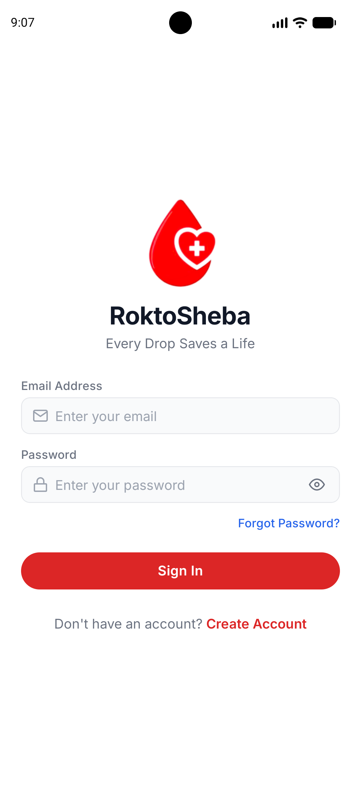 | 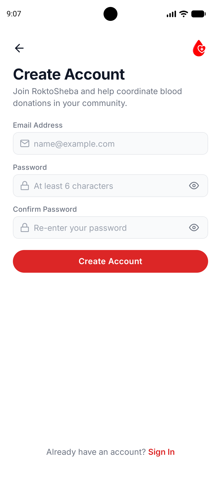 | 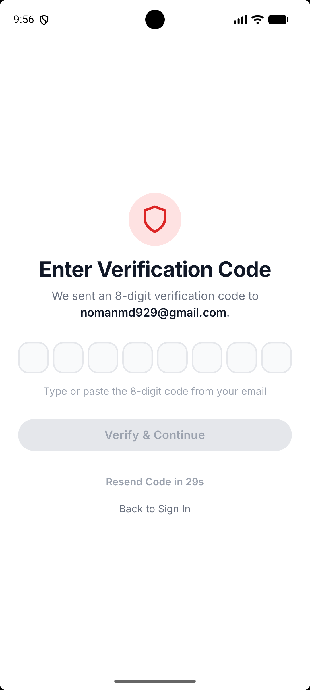 | 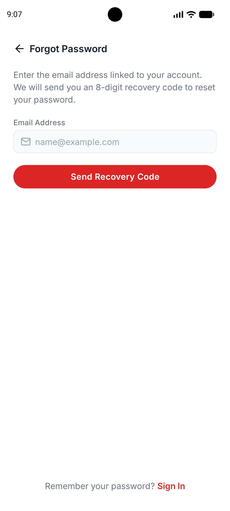 |
|                       _Email & password authentication_                        |                           _Live password strength indicator_                            |                                 _Native 8-box numeric OTP_                                 |                                 _Recovery code dispatch_                                 |

<br/>

### 2. Guided Onboarding & Donor Eligibility Setup

_Custom age-constrained calendar picker enforcing legal donor criteria ($\ge 16$ years) & full 64-district Bangladesh hierarchy._

|                           **Profile Onboarding Wizard**                            |                             **Age-Constrained Native Date Picker**                             |
| :--------------------------------------------------------------------------------: | :--------------------------------------------------------------------------------------------: |
| 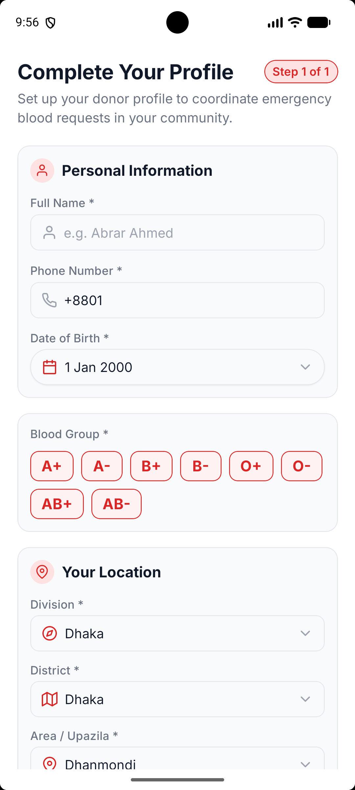 | 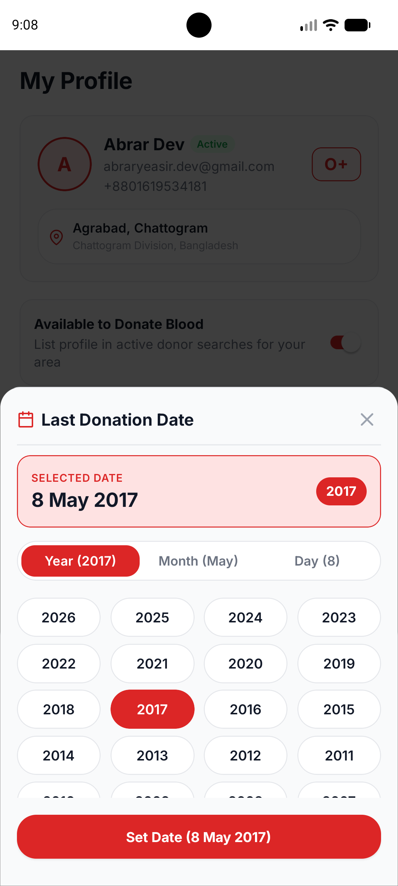 |
|                      _Division, District & Blood Group setup_                      |                           _Interactive $\ge 16$ years age validator_                           |

<br/>

### 3. Home Feed & Blood Request Coordination

_Live urgency tags, real-time request discovery, prescription document proof verification, and requester management._

|                                **Home Dashboard**                                 |                               **Blood Requests Feed**                                |                            **Request Details & Coordination**                            |
| :-------------------------------------------------------------------------------: | :----------------------------------------------------------------------------------: | :--------------------------------------------------------------------------------------: |
| 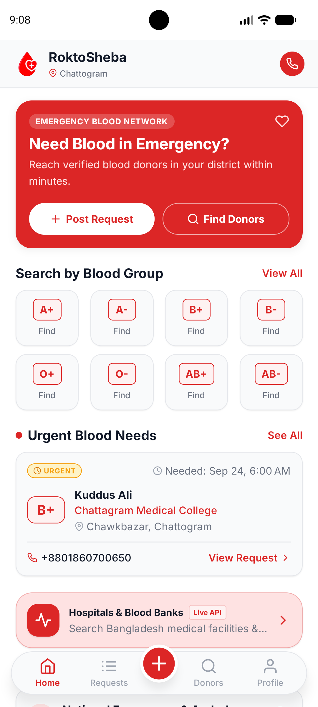 | 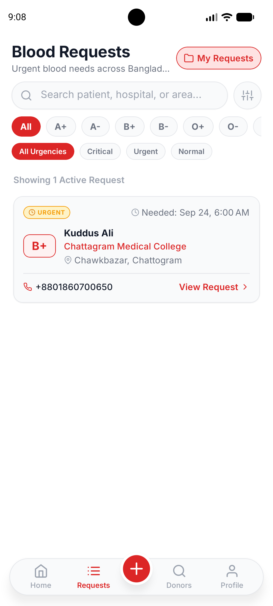 | 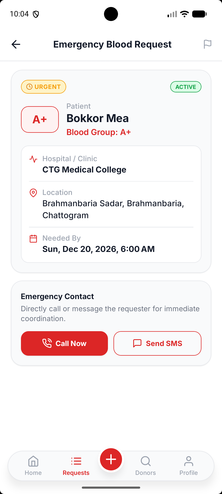 |
|                    _Greeting, Quick Actions & Urgent Carousel_                    |                         _Search & multi-filter bottom sheet_                         |                        _Urgency pulse tag, proof image & calling_                        |

|                                      **Create Blood Request**                                      |                             **My Requests Manager**                              |
| :------------------------------------------------------------------------------------------------: | :------------------------------------------------------------------------------: |
| 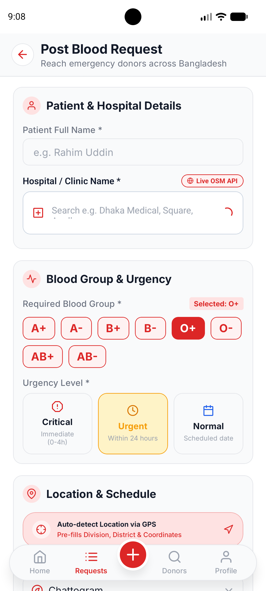 | 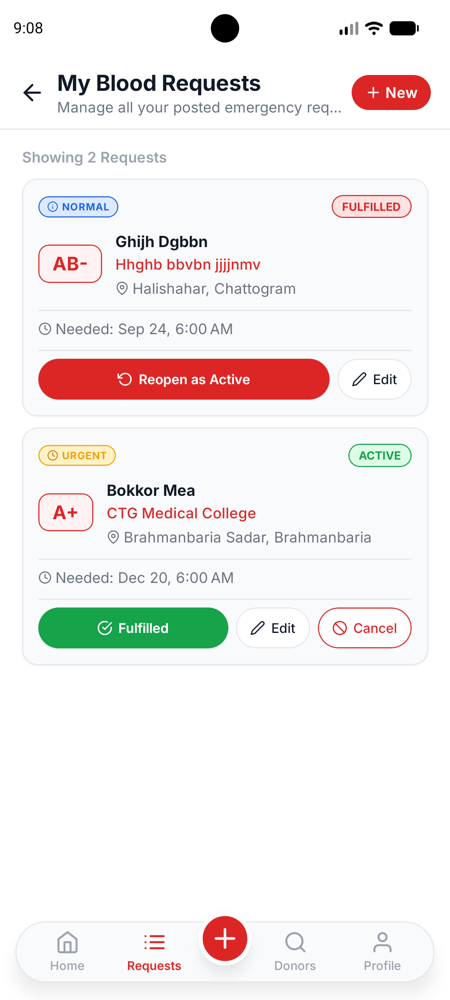 |
|                        _Prescription proof upload & Nominatim autocomplete_                        |                  _Track Active, Fulfilled & Cancelled requests_                  |

<br/>

### 4. Voluntary Donor Discovery & Emergency Facilities

_Multi-parameter voluntary donor discovery with medical availability badges and live OpenStreetMap Nominatim facility integration._

|                            **Find Voluntary Donors**                             |                               **Donor Public Profile**                                |                                **Emergency Hospital Directory**                                |
| :------------------------------------------------------------------------------: | :-----------------------------------------------------------------------------------: | :--------------------------------------------------------------------------------------------: |
| 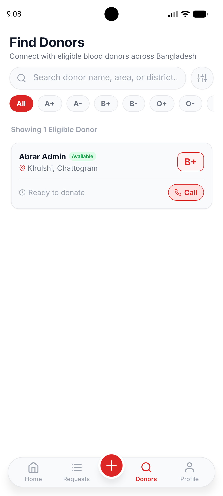 | 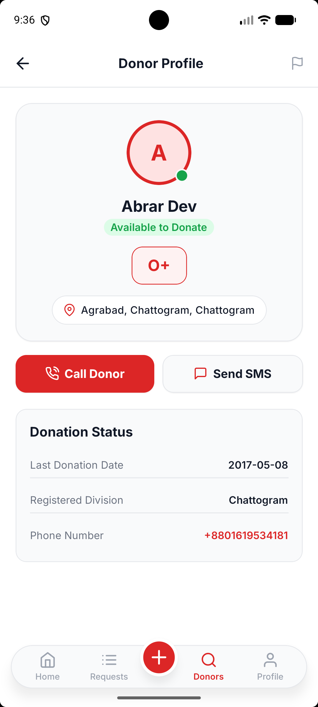 | 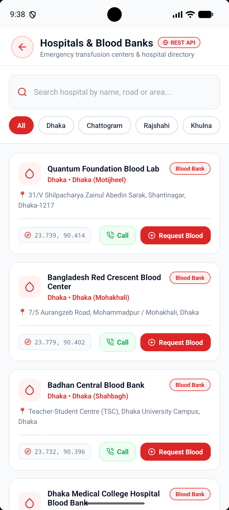 |
|                   _Blood group pills & available-only toggle_                    |                    _Donation history & 90-day cooldown countdown_                     |                        _Real-time Nominatim REST search & direct dial_                         |

<br/>

### 5. User Profile Management & Cooldown Tracking

_Self-service donor availability toggle, 90-day eligibility countdown algorithm, and camera/gallery avatar upload._

|                        **User Profile & Cooldown Tracker**                         |                            **Edit Profile & Avatar Changer**                            |
| :--------------------------------------------------------------------------------: | :-------------------------------------------------------------------------------------: |
| 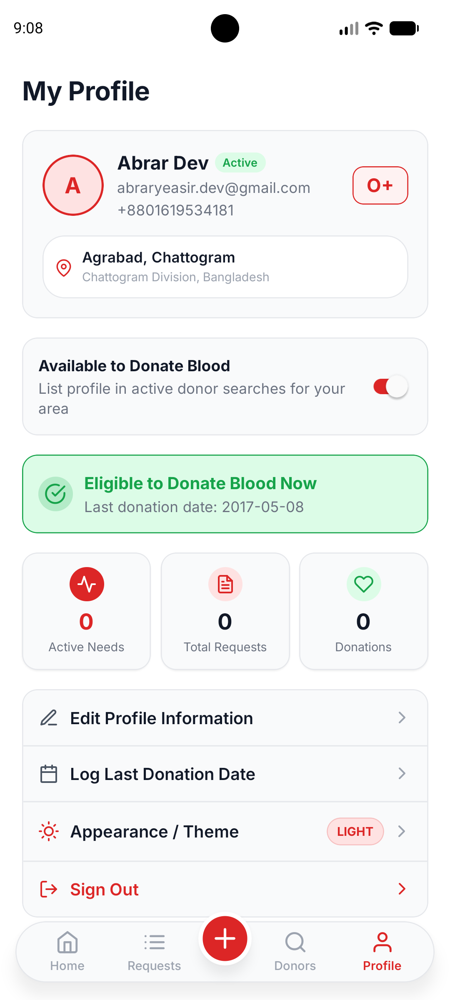 | 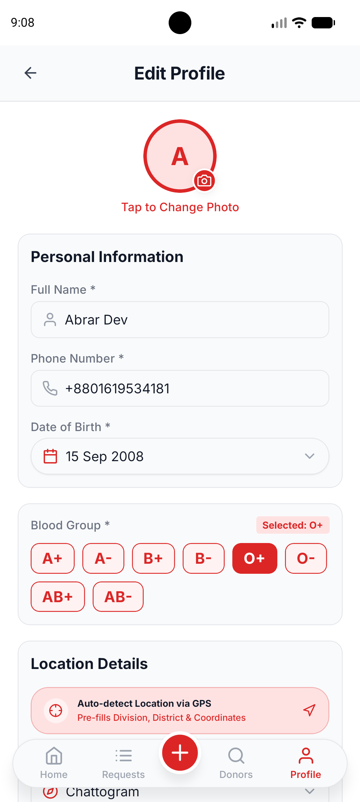 |
|                  _Donor availability switch & eligibility banner_                  |                       _Camera / gallery picker & address updater_                       |

<br/>

### 6. Role-Based Admin Governance & Moderation Portal

_Full administrative control: real-time platform KPIs, user moderation, request force-cancellation, and community report queues._

|                                     **Admin Control Panel**                                      |                                 **User Management & Banning**                                  |                                        **Request Moderation**                                        |                               **Community Reports Queue**                                |
| :----------------------------------------------------------------------------------------------: | :--------------------------------------------------------------------------------------------: | :--------------------------------------------------------------------------------------------------: | :--------------------------------------------------------------------------------------: |
| 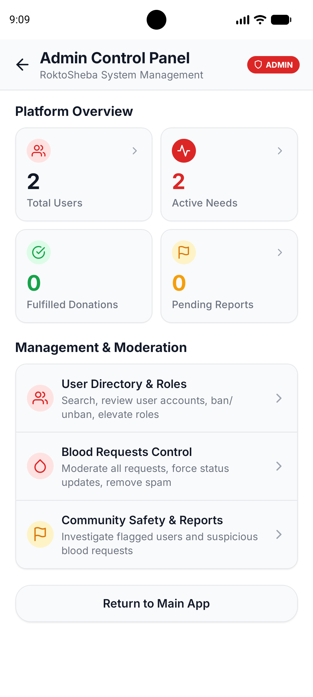 | 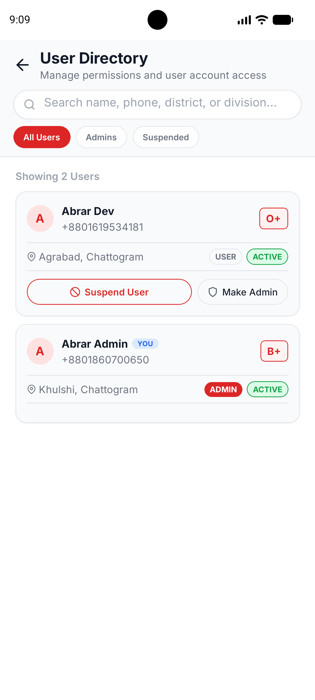 | 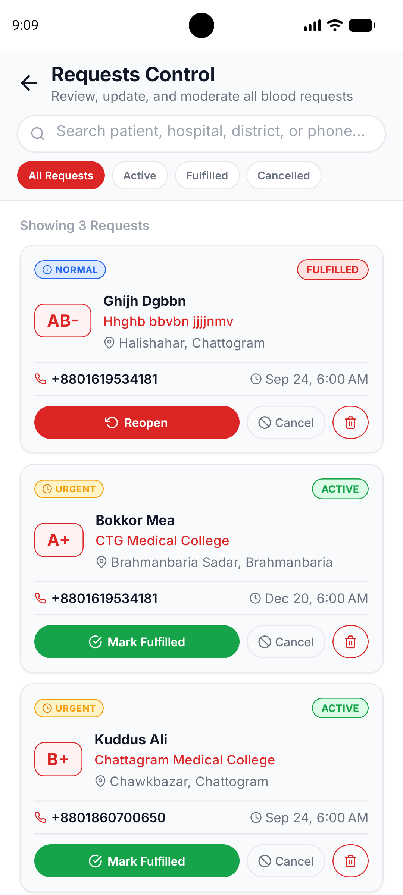 | 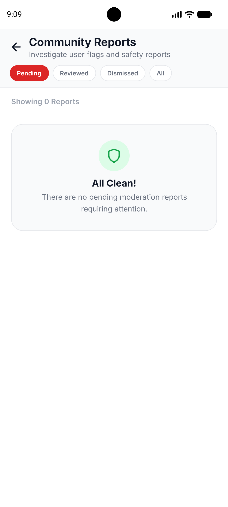 |
|                             _Real-time platform metrics & overview_                              |                          _Search users & toggle active/banned status_                          |                               _Review active requests & force cancel_                                |                          _Handle community abuse/fraud reports_                          |

</div>

---

## 📌 Executive Summary & Core Value Proposition

In Bangladesh, securing emergency blood during medical crises—such as road traffic accidents, emergency cesarean deliveries, and thalassemia transfusions—often relies on chaotic, unverified social media posts. Critical hours are lost filtering out outdated requests and inactive donors.

**RoktoSheba** bridges this gap with a modern, high-performance, mobile-first coordination ecosystem:

- **Zero-Role Barrier (Dual-Identity Model):** Every citizen has a single account. A user can request blood for a family member in the morning and respond as an active voluntary donor in the afternoon. Donor discoverability is governed dynamically via the `is_available_to_donate` switch.
- **Privacy-First Safety Architecture:** Donors' exact residential GPS coordinates and contact phone numbers are protected. Requesters only gain direct calling access after mutual coordination or response acceptance.
- **Localized for Bangladesh (All 64 Districts):** Built-in dataset encompassing all 8 Administrative Divisions, 64 Districts, and local Upazilas/Thanas with zero API lag.
- **8-Digit Native Email OTP Authentication:** Eliminates fragile external browser redirects, magic links, or third-party OAuth failures. Users verify directly in-app with individual auto-advancing OTP input boxes.
- **Live Hospital & Healthcare Directory:** Direct integration with the OpenStreetMap Nominatim REST API enables instant real-time facility search, autocomplete, and one-tap emergency calling across Bangladesh.
- **Automated Donor Eligibility Engine:** 90-day medical cooldown calculation with automatic eligibility badges and countdown timers.
- **Standalone Android APK Optimized:** Engineered with ABI splitting (`arm64-v8a`, `armeabi-v7a`) for a lightweight APK (~35 MB) that launches smoothly without startup crashes.

---

## 🛠 Complete Tech Stack & Architecture

| Engineering Concern         | Framework / Library                       | Version / Standard                                                          | Architectural Role                                                                                     |
| :-------------------------- | :---------------------------------------- | :-------------------------------------------------------------------------- | :----------------------------------------------------------------------------------------------------- |
| **Runtime & Core**          | **Expo SDK 54 / React Native**            | `~54.0.36` / `0.81.5`                                                       | Strict TypeScript runtime with Hermes JS engine.                                                       |
| **Navigation & Routing**    | **Expo Router**                           | `~6.0.24` (v4+)                                                             | File-based typed routing with layout guards (`(auth)`, `(onboarding)`, `(main)`, `admin`).             |
| **Backend & Cloud DB**      | **Supabase (PostgreSQL 15)**              | `@supabase/supabase-js` `^2.112.4`                                          | Serverless backend with strict Row-Level Security (RLS) policies.                                      |
| **Client Session Store**    | **AsyncStorage**                          | `@react-native-async-storage` `2.2.0`                                       | Persistent authentication sessions and offline state caching.                                          |
| **Server State & Cache**    | **TanStack Query (React Query)**          | `^5.102.6`                                                                  | Query Key Factory pattern, background refetching, and automatic cache invalidation.                    |
| **Client Local State**      | **Zustand**                               | `^5.0.15` (v5)                                                              | Atomic client stores (`useAuthStore`, `useThemeStore`, `useDialogStore`) with zero re-render cascades. |
| **Styling & Design Tokens** | **NativeWind (Tailwind CSS)**             | `4.2.1` / `3.4.17`                                                          | Utility-first styling with custom design tokens, dark mode class support, and Inter font.              |
| **Forms & Validation**      | **React Hook Form + Zod**                 | `^7.86.0` / `^4.4.3`                                                        | Schema-driven form validation with zero unchecked runtime inputs.                                      |
| **External REST API**       | **OpenStreetMap Nominatim**               | REST v1 (Bangladesh bounded)                                                | Real-time hospital geocoding, medical facility autocomplete, and coordinates lookup.                   |
| **Hardware & Native API**   | **Expo Native Modules**                   | `expo-image-picker`, `expo-location`, `expo-haptics`, `expo-navigation-bar` | Camera photo capture, gallery document proof upload, GPS location, and immersive navigation bar.       |
| **Build & Release**         | **EAS Build (Expo Application Services)** | CLI `^15.0.0`                                                               | Standalone APK compilation with architecture splitting and secure environment injection.               |

---

## 📁 Codebase Directory Structure & File Map

RoktoSheba follows a **Feature-Driven Clean Architecture** where each domain module encapsulates its own UI presentation, view models (custom hooks), data access services, and validation schemas:

```text
RoktoSheba/
├── app/                                  # Expo Router UI layer (File-based Navigation)
│   ├── (auth)/                           # Unauthenticated Route Group
│   │   ├── _layout.tsx                   # Auth Stack layout with headerless transitions
│   │   ├── login.tsx                     # Email/Password login with unverified email auto-redirection
│   │   ├── register.tsx                  # Sign-up form with live password strength validation
│   │   ├── forgot-password.tsx           # Password recovery 8-digit OTP dispatcher
│   │   ├── reset-password.tsx            # 8-Digit OTP recovery & new password setup
│   │   └── verify-email.tsx              # Interactive 8-box numeric OTP verification screen
│   ├── (onboarding)/                     # Profile Completion Guard Group
│   │   ├── _layout.tsx                   # Onboarding guard preventing unauthenticated access
│   │   └── index.tsx                     # Profile wizard: Age verification, 64-district picker, blood group
│   ├── (main)/                           # Main Authenticated Tab Navigation
│   │   ├── _layout.tsx                   # Custom floating bottom tab bar + center Action Button
│   │   ├── index.tsx                     # Home Dashboard: Greeting, quick actions, urgent requests carousel
│   │   ├── requests/                     # Blood Requests Module
│   │   │   ├── _layout.tsx               # Stack navigation for blood requests
│   │   │   ├── index.tsx                 # Feed & discovery with search and filter bottom sheet
│   │   │   ├── create.tsx                # Request creation with hospital autocomplete & prescription upload
│   │   │   ├── edit.tsx                  # Edit existing blood request parameters
│   │   │   ├── my-requests.tsx           # User's created requests manager (Active/Fulfilled/Cancelled)
│   │   │   └── [id].tsx                  # Request detail: urgency badge, caller button, responses coordinator
│   │   ├── donors/                       # Donor Discovery Module
│   │   │   ├── _layout.tsx               # Donors stack layout
│   │   │   ├── index.tsx                 # Search donors, blood group filter pills, available-only toggle
│   │   │   └── [id].tsx                  # Donor public profile, eligibility status, call action, report modal
│   │   └── profile/                      # Profile & Settings Module
│   │       ├── _layout.tsx               # Profile stack layout
│   │       ├── index.tsx                 # Profile hero card, availability toggle, 90-day cooldown, theme switcher
│   │       └── edit.tsx                  # Edit profile info & camera/gallery avatar changer
│   ├── admin/                            # Role-Based Admin Portal (RBAC Guard)
│   │   ├── _layout.tsx                   # Admin role check (is_admin layout guard)
│   │   ├── dashboard.tsx                 # Admin metrics: total users, active requests, pending reports
│   │   ├── users.tsx                     # User list, search, ban/unban actions, admin promotion
│   │   ├── requests.tsx                  # Request moderation: force cancel, mark fulfilled
│   │   └── reports.tsx                   # Community reports queue: review, dismiss, take action
│   ├── hospitals.tsx                     # Dedicated Emergency Hospital Directory (OpenStreetMap Nominatim)
│   ├── _layout.tsx                       # Root Layout: QueryClientProvider, StatusBar, FontLoader, AppDialog
│   └── +not-found.tsx                    # 404 Route handler
├── assets/                               # Static Media & Typography Assets
│   ├── fonts/                            # Inter (Regular, Medium, SemiBold, Bold) font files
│   └── images/                           # Image-first badges, blood group pills, logo, splash screen
│       ├── blood-groups/                 # High-resolution blood badges (A+, A-, B+, B-, O+, O-, AB+, AB-)
│       ├── urgency/                      # Normal, Urgent, Critical visual badges
│       └── rokto-sheba-app-logo.png      # Primary branding asset
├── components/                           # Shared Reusable UI Primitives
│   ├── feedback/                         # User feedback primitives
│   │   └── ErrorBanner.tsx               # Inline collapsible form error alerts
│   ├── navigation/                       # Custom Navigation UI
│   │   └── CustomFloatingTabBar.tsx      # Elevated floating tab bar with centered FAB button
│   └── ui/                               # Atomic UI Components
│       ├── AppButton.tsx                 # Haptic-enabled primary/secondary/outline buttons with loading state
│       ├── AppDatePicker.tsx             # Age-constrained native date picker (>= 16 years donor rule)
│       ├── AppDateTimePicker.tsx         # Unified date & time picker for blood request scheduling
│       ├── AppDialog.tsx                 # Global animated confirmation and alert modal system
│       ├── AppInput.tsx                  # Controlled text inputs with leading icons and error hints
│       ├── AppTimePicker.tsx             # 12h/24h time picker with AM/PM toggle and quick presets
│       ├── BloodGroupBadge.tsx           # Image-first static blood group renderer
│       ├── BloodGroupSelector.tsx        # 8-badge interactive blood group selector grid
│       ├── DocumentUploadPicker.tsx      # Prescription proof image picker with camera/gallery choice
│       ├── HospitalSearchInput.tsx       # Nominatim REST API hospital autocomplete dropdown
│       ├── LocationDetector.tsx          # Real-time GPS coordinate detector with reverse geocoding
│       ├── LocationSelector.tsx          # Bangladesh division & district dropdown modal trigger
│       ├── OtpInput.tsx                  # 8-box numeric OTP component with auto-focus and clipboard paste
│       ├── PermissionRationaleModal.tsx  # Pre-permission educational dialogs for Camera & Location
│       ├── ReportModal.tsx               # Moderation report submission modal for users & requests
│       ├── SelectModal.tsx               # Searchable selection modal for 64 districts and divisions
│       ├── ThemeSelectorModal.tsx        # In-app Light / Dark / System theme switcher
│       └── UrgencyTag.tsx                # Urgency level badge with color coding (Normal/Urgent/Critical)
├── features/                             # Modular Domain Business Logic
│   ├── admin/                            # Admin Governance Domain
│   │   ├── hooks/useAdmin.ts             # Admin metrics, user list, and moderation mutations
│   │   └── services/adminService.ts      # Supabase admin API service layer
│   ├── auth/                             # Authentication Domain
│   │   ├── hooks/useAuth.ts              # Reactive auth state wrapper
│   │   ├── schemas/authSchema.ts         # Zod schemas: login, register, OTP, forgot-password
│   │   ├── services/authService.ts       # Supabase auth methods (OTP verification, signup, signout)
│   │   └── stores/useAuthStore.ts        # Zustand v5 global authentication store
│   ├── dialog/                           # Global Dialog Domain
│   │   └── useDialogStore.ts             # Zustand v5 dialog store for imperative AppDialog triggers
│   ├── donors/                           # Donor Discovery Domain
│   │   ├── components/                   # DonorCard, DonorFilterSheet
│   │   ├── hooks/useDonors.ts            # TanStack queries for donor search and profile details
│   │   └── services/donorService.ts      # Supabase query service for public donors
│   ├── hospitals/                        # Hospital Directory Domain
│   │   ├── hooks/useHospitalSearch.ts    # Debounced hospital search hook
│   │   ├── services/hospitalApiService.ts# OpenStreetMap Nominatim REST API service
│   │   └── types/hospital.types.ts       # Nominatim facility response interfaces
│   ├── permissions/                      # Runtime Hardware Permissions Domain
│   │   ├── hooks/usePermission.ts        # Reusable permission hook with rationale modal
│   │   ├── services/permissionService.ts # Expo native permissions wrapper (Camera, Location, Media)
│   │   └── types/permission.types.ts     # Permission status types
│   ├── profile/                          # User Profile Domain
│   │   ├── components/                   # ProfileHeroCard, ProfileStatsGrid, DonationEligibilityBanner, LogDonationModal
│   │   ├── hooks/useProfile.ts           # Profile data queries, update mutations, donation logging
│   │   ├── schemas/profileSchema.ts      # Profile Zod validation schemas
│   │   └── services/profileService.ts    # Supabase profile & storage upload API
│   ├── requests/                         # Blood Requests Domain
│   │   ├── components/                   # RequestCard, RequestFilterSheet, UrgencySelector
│   │   ├── hooks/useRequests.ts          # Queries for request list, detail, create, edit, responses
│   │   ├── schemas/requestSchema.ts      # Zod validation schemas for request forms
│   │   └── services/requestService.ts    # Supabase CRUD service for blood_requests and donation_responses
│   └── theme/                            # Theming Domain
│       └── useThemeStore.ts              # Zustand v5 theme store with AsyncStorage persistence
├── lib/                                  # Infrastructure & Utility Layer
│   ├── supabase/                         # Supabase Client Singleton
│   │   └── client.ts                     # createClient with AsyncStorage and resilient fallback keys
│   ├── queryClient.ts                    # TanStack Query client configuration (stale times, gc times)
│   └── utils/                            # Shared Utilities
│       └── bangladeshLocations.ts        # Complete dataset of 8 divisions, 64 districts & upazilas
├── types/                                # TypeScript Interfaces
│   └── database.types.ts                 # Strongly-typed Supabase PostgreSQL schema definitions
├── docs/                                 # Dedicated Documentation
│   ├── SUPABASE_SETUP.md                 # Complete SQL script, RLS policies, storage & email templates
│   └── RUNNING_INSTRUCTIONS.md           # Local setup, doctor checks, EAS build & troubleshooting
├── app.json                              # Expo project manifest & native build properties
├── eas.json                              # EAS Cloud Build configurations (preview APK & production AAB)
├── tailwind.config.js                    # NativeWind theme tokens, custom colors, and font configuration
└── tsconfig.json                         # Strict TypeScript configuration
```

---

## ⚡ Core Domain Walkthrough & Feature Highlights

### 1. Authentication & Security Engine

- **8-Digit Numeric OTP:** Replaces vulnerable magic links with an 8-box numeric OTP delivered straight to the user's email. Features auto-focus advancement, backspace retraction, and clipboard paste support (`components/ui/OtpInput.tsx`).
- **Unverified Account Auto-Dispatch:** If an unconfirmed user attempts to log in, RoktoSheba detects the Supabase `Email not confirmed` response, dispatches a fresh 8-digit OTP code, and routes them directly to `/(auth)/verify-email`.
- **Password Recovery:** Secure password reset pipeline using 8-digit OTP recovery codes and real-time password strength validation.
- **Session Persistence:** Configured with `@react-native-async-storage/async-storage` in [`lib/supabase/client.ts`](lib/supabase/client.ts) so sessions survive app restarts and system memory reclamation.

### 2. Guided Onboarding & Donor Eligibility Lifecycle

- **Age-Constrained Onboarding:** Custom date picker enforces donor legal/medical guidelines ($\ge 16$ years of age) and calculates age in real time.
- **Bangladesh Geographic Hierarchy:** Searchable dropdown modal covering all 8 Divisions and 64 Districts with sub-area selection (`lib/utils/bangladeshLocations.ts`).
- **90-Day Medical Cooldown Calculation:** The profile engine tracks the user's `last_donation_date`. If fewer than 90 days have elapsed, the user is marked _"On Cooldown"_ with an eligibility countdown banner. Once 90 days pass, the system automatically marks them _"Eligible to Donate"_.
- **"Log a Donation" Action:** Users can log a recent blood donation via a dedicated modal (`LogDonationModal.tsx`), instantly resetting their 90-day cooldown and updating their public donor profile.

### 3. Blood Request Engine

- **Complete Request Creation:** Requesters specify Patient Name, Blood Group (image-first selector), Hospital Name (with live autocomplete), Division, District, Area, Needed Date & Time, Contact Number, and Urgency Tier.
- **Medical Prescription Proof Upload:** Camera or Photo Library image picker with thumbnail preview and removal action (`DocumentUploadPicker.tsx`), backed by Supabase `request-documents` storage bucket.
- **Three Urgency Tiers:**
  - 🟢 **Normal:** Scheduled procedures, routine transfusions.
  - 🟡 **Urgent:** Procedures required within 12–24 hours.
  - 🔴 **Critical:** Immediate life-saving emergencies (trauma, ICU, severe hemorrhaging) highlighted with high-contrast alert tags.
- **Request Management:** Requesters can edit request details, cancel active requests, or mark them fulfilled once donations are completed (`app/(main)/requests/my-requests.tsx`).

### 4. Donor Discovery & Geographic Matching

- **Multi-Parameter Search:** Real-time search across donor names, districts, and areas.
- **Filter Bottom Sheet (`DonorFilterSheet.tsx`):** Filter by Blood Group pills (`A+`, `A-`, `B+`, `B-`, `O+`, `O-`, `AB+`, `AB-`), Division, District, and an _"Available Donors Only"_ toggle.
- **Donor Public Profile (`app/(main)/donors/[id].tsx`):** Displays avatar, verified blood badge, division/district, donation history count, and eligibility status. Provides direct phone dialer integration for matched emergencies and community reporting.

### 5. Donation Response & Coordination Lifecycle

- **Donation Responses Table (`donation_responses`):** Willing donors can submit a response to an active blood request along with an optional message.
- **Requester Response Management:** Requesters view incoming donor responses in real-time, with options to **Accept** or **Decline**.
- **Privacy Handshake:** A donor's contact phone number is strictly shared with the requester upon response acceptance.

### 6. External REST API: Emergency Hospital Directory

- **OpenStreetMap Nominatim REST API:** Integrated in [`features/hospitals/services/hospitalApiService.ts`](features/hospitals/services/hospitalApiService.ts).
- **Bangladesh Bounding Coordinates:** Geocoding queries are strictly bounded to Bangladesh (`countrycodes=bd`), returning authentic hospitals, clinics, and medical complexes.
- **Dedicated Directory (`app/hospitals.tsx`):** Search hospitals across any district, view address information, initiate direct emergency calls, or open GPS coordinates in Google Maps.

### 7. Native Hardware Integrations & Permissions Architecture

- **Educational Permission Priming:** Uses `PermissionRationaleModal.tsx` to explain why camera or location access is needed before prompting system dialogs, adhering to Google Play guidelines.
- **Camera Capture:** `expo-image-picker` with `launchCameraAsync` for capturing prescriptions and avatar photos.
- **Gallery Selection:** `launchImageLibraryAsync` for selecting stored documents and images.
- **GPS Coordinates & Reverse Geocoding:** `expo-location` detects current coordinates in `LocationDetector.tsx` and reverse-geocodes district and area for emergency blood requests.
- **Tactile Haptic Feedback:** Integrated via `expo-haptics` across button presses, modal openings, and state changes.

### 8. Multi-Role RBAC & Admin Governance Portal

- **Role-Based Layout Guard:** Protected navigation in `app/admin/_layout.tsx` verifies `role === 'admin'`. Unauthorized regular users are redirected back to the home tab.
- **Admin Dashboard (`app/admin/dashboard.tsx`):** Real-time analytics displaying Total Users, Total Donors, Active Blood Requests, and Pending Moderation Reports.
- **User Moderation (`app/admin/users.tsx`):** Search users, toggle active/banned status (`is_active`), and promote trusted coordinators to admin.
- **Request Moderation (`app/admin/requests.tsx`):** Review active requests, force-cancel fraudulent posts, or mark fulfilled.
- **Community Reports Queue (`app/admin/reports.tsx`):** Review abuse or spam reports submitted by users against suspect accounts or requests.

### 9. UI/UX Design System, Theming & Accessibility

- **Design Tokens:** High-contrast emergency red (`#DC2626`) primary, slate-900 typography, and clean surface backgrounds defined in [`tailwind.config.js`](tailwind.config.js).
- **Image-First UI Assets:** Static blood group badges (`assets/images/blood-groups/badge-*.png`) ensure crisp rendering across all screen densities without SVG font dependencies.
- **Elevated Floating Tab Bar:** Custom navigation bar with a raised center Action Button for rapid blood request creation (`CustomFloatingTabBar.tsx`).
- **Persistent Theme Engine:** NativeWind v4 `darkMode: "class"` with `useThemeStore.ts` persisting Light, Dark, or System mode to `AsyncStorage`.
- **Global Modal System (`AppDialog.tsx`):** Imperative dialog triggers via `useDialogStore` for confirmations, warnings, and error alerts.

---

## 🏗 State Management & Data Flow Architecture

RoktoSheba separates client UI state from server-synced data state:

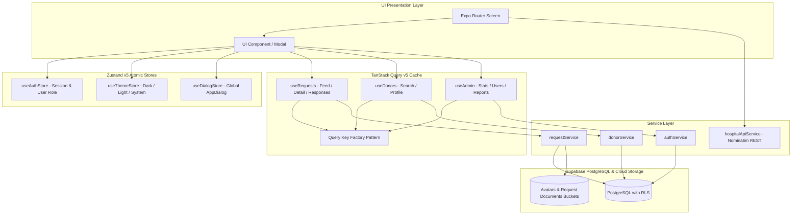

### Query Key Factory Standard

All TanStack Query keys are centralized to prevent cache key collisions and facilitate deterministic cache invalidation:

```typescript
// Query Key Factory pattern example
export const requestKeys = {
  all: ["requests"] as const,
  lists: () => [...requestKeys.all, "list"] as const,
  list: (filters: RequestFilters) => [...requestKeys.lists(), filters] as const,
  details: () => [...requestKeys.all, "detail"] as const,
  detail: (id: string) => [...requestKeys.details(), id] as const,
  myRequests: (userId: string) =>
    [...requestKeys.all, "my-requests", userId] as const,
};
```

---

## 🗄 Backend Database, RLS & Storage Setup

The complete database schema, Row-Level Security (RLS) policies, storage bucket rules, and HTML email templates are thoroughly documented in:

### 📖 [Detailed Supabase Backend Guide (docs/SUPABASE_SETUP.md)](docs/SUPABASE_SETUP.md)

**Summary of Database Tables:**

1. `profiles`: User accounts, personal details, blood group, division/district, donor availability, and role (`user` vs `admin`).
2. `blood_requests`: Emergency blood posts, hospital name, location, urgency tier, needed date/time, and prescription URL.
3. `donation_responses`: Donor coordination responses linked to blood requests.
4. `donation_feedback`: Post-donation ratings (1–5 stars) and reviews.
5. `notifications`: In-app notification alerts for response updates.
6. `reports`: Moderation reports on suspicious accounts or requests.

---

## 🚀 Running, Testing & Building the Application

For a comprehensive guide covering local server startup, diagnostic verifications, and EAS build parameters:

### 📖 [Local Running & EAS Build Instructions (docs/RUNNING_INSTRUCTIONS.md)](docs/RUNNING_INSTRUCTIONS.md)

### Quick Start Commands

```bash
# 1. Install dependencies
bun install

# 2. Configure environment
cp .env.example .env

# 3. Start Expo development server
bun start

# 4. Run automated code health checks
bun run doctor        # Runs expo-doctor (18/18 checks)
bunx tsc --noEmit     # TypeScript static compiler check (0 errors)
bun run lint          # ESLint code style audit

# 5. Build Standalone Android APK via EAS
eas build --platform android --profile preview
```

---

## ⚡ Production Engineering & APK Size Optimizations

1. **Native ABI Splitting (~60% Size Reduction):**
   - Standard universal APKs contain bulky `x86` and `x86_64` PC emulator binaries that exceed 50% of the build size.
   - Configured [`app.json`](app.json) with `expo-build-properties` to target physical devices exclusively (`arm64-v8a` and `armeabi-v7a`), trimming the final standalone APK to **~35 MB**.
2. **Reanimated 4 & TurboModules Stability:**
   - Disabled aggressive R8/ProGuard code obfuscation (`enableMinifyInReleaseBuilds`), protecting dynamic JNI reflection lookups and worklet bindings from being stripped on startup.
3. **Resilient Supabase Client Fallbacks:**
   - [`lib/supabase/client.ts`](lib/supabase/client.ts) includes built-in fallback constants (`DEFAULT_SUPABASE_URL` and `DEFAULT_SUPABASE_KEY`). The app will never crash on launch due to missing environment variable injections during offline or standalone executions.

---

## 🤖 AI Agent Technical Handbook & Quick-Reference

This section serves as a direct technical orientation for autonomous AI agents or external developers navigating this codebase:

| Concept / Invariant         | Implementation Standard & Rule                                                                                                                               |
| :-------------------------- | :----------------------------------------------------------------------------------------------------------------------------------------------------------- |
| **Strict Type Safety**      | Never use `any`. Derive types from `database.types.ts` or Zod schemas in `features/*/schemas/`.                                                              |
| **Authentication State**    | Read session or user from `useAuthStore.getState()` or the reactive hook `useAuth()`. Avoid React Context wrappers.                                          |
| **Routing & Navigation**    | Always use Expo Router (`useRouter()`, `<Link>`). Use route groups: `(auth)` for unauthenticated screens, `(main)` for tabs, and `admin` for admin portal.   |
| **Form Management**         | All forms must use `react-hook-form` paired with `@hookform/resolvers/zod`. Inline errors render via `ErrorBanner.tsx`.                                      |
| **Hardware Permissions**    | Wrap hardware requests using `usePermission(type)`. Always display `PermissionRationaleModal` before triggering OS system prompts.                           |
| **Query Mutations**         | Every mutation in `features/*/hooks/` must explicitly invalidate target query keys on `onSuccess` via `queryClient.invalidateQueries({ queryKey })`.         |
| **Design Tokens & Styling** | Style with NativeWind v4 classes. Primary red `#DC2626` is tokenized as `bg-primary` / `text-primary`. Dark mode surfaces use `bg-slate-900` / `text-white`. |
| **Locations Dataset**       | Never hardcode Bangladesh districts. Always import from `lib/utils/bangladeshLocations.ts` (`BANGLADESH_DIVISIONS`, `DIVISIONS_WITH_DISTRICTS`).             |

---

## 📄 License & Attribution

This project is licensed under the **MIT License**.  
Designed and engineered for emergency medical coordination across Bangladesh.
